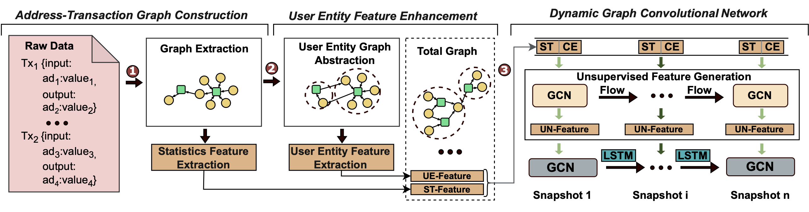

# BadDet
This repo is a python implementation of our ***BadDet***. BadDet is a framework designed for detecting fraud in blockchain systems, particularly Bitcoin. Utilizing dynamic Graph Convolutional Networks (GCNs), BadDet identifies fraudulent addresses and anomalous behaviors in a dynamic and large-scale blockchain network.

## Overview

Blockchain networks like Bitcoin provide anonymity, which can be exploited for illicit activities. Current fraud detection approaches often fail to account for the dynamic and imbalanced nature of these networks. BadDet addresses these challenges with the following contributions:

- We convert Bitcoin transactions into an address-transaction graph structure, creating the first large-scale dynamic heterogeneous Bitcoin dataset: **AT-DynBTC**. This dataset comprises 5 types of address behaviors with a label rate of **60.50%**.

- We propose a clustering algorithm for **user entity graph construction** and **user entity feature extraction**. This algorithm can cluster large-scale Bitcoin addresses with lower computational time and is capable of leveraging **multi-core processors** and **distributed environments**.

- We propose a **dynamic GCN model** which employs an **unsupervised feature generation module** to derive low-dimensional representations for effective fraudulent identification. Then, we adapt GCN along the temporal dimension to dynamically update the weight matrices of different GCN layers.

- Comprehensive experiments are conducted to evaluate the effectiveness of **BadDet**, and the experimental results demonstrate its superiority in detecting node-level anomalies on dynamic graphs, achieving an **F1-score of 84.9%** and an **AUC of 95.8%**.

## Required Packages
* **Python** 3.7 or above
* **PyTorch**1.4.0
* **PyG (PyTorch Geometric)** 2.0.4
* **Pandas** 1.3.5
* **NumPy** 1.21.6

